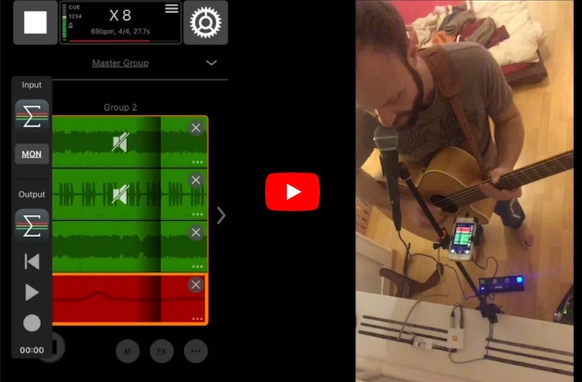

# Group the Loop Performer

**The goal of Group the Loop Performer (GTL-Performer) is to enable a single person to become a 1-person-band by letting them perform basic pop/rock/whatever songs in a live situation.**

GTL-Performer is a collection of scripts written in [Mozaic](https://apps.apple.com/us/app/mozaic-plugin-workshop/id1457962653). It controls a bunch of iOS apps ([Group the Loop [GTL]](https://apps.apple.com/us/app/group-the-loop/id1029416579), [Audio Mixer [AUM]](https://apps.apple.com/us/app/aum-audio-mixer/id1055636344), and others) that enable a singing guitarist to do advanced looping performances, including:

- Building song structures (verse, chorus, bridge, etc.) using groups of loops
- Deciding what should be recorded to a loop (either guitar, or microphone, or both)
- Applying different FX to guitar (virtual amps), keyboard (instruments presets) and microphone (chorus, vocoder, etc.)

You can control all this live using only a [BlueBoard](https://www.ikmultimedia.com/products/irigblueboard/); or you can create presets in advance and walk through them later on (like a step sequencer).

## Setting up all the gear

- [Requirements (Hardware and Apps)](./REQUIREMENTS.md)
- [Configuration](./CONFIGURATION.md)

## See it in action

### Preset mode

You can create presets (pre-defined song structures) that will handle all the complex stuff for you when performing live. At the tip of your toe, by clicking a button on your BlueBoard, you can walk through a preset, one step at a time (similar to a step sequencer).

Presets are written in Markdown (using fancy emojis 🎤🎸🎹).

See [Preset mode](./USAGE_PRESET.md) for more details.

### Live mode

By enhancing your BlueBoard's capabilities tremendously (GTL-Performer recognises button combinations and differentiates between key press durations), control over the complete setup is at the tip of your toe.

See [Live mode](./USAGE_LIVE.md) for more details.

## Future ideas

- Use MIDI Guitar on voice (e.g. to simulate a violin with vibrato)
- Record MIDI patterns and replay them
- Apply various algorithms on MIDI patterns, e.g. filtering out unwanted notes, detecting chords, quantizing notes, applying a different chord to a recorded pattern, sending bass notes to a different virtual instrument than high notes, etc.
- Apply FX to main out (e.g. chorus, flanger...)

Some day, it should not be necessary at all anymore to look at the iOS device's screen! Everything will be working through foot input (via BlueBoard, in advance to and while performing) and audio feedback (via headphones).
